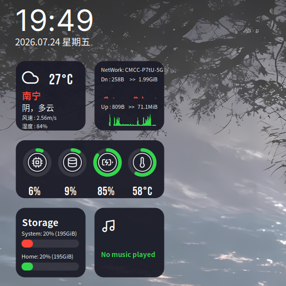

# Mimosa Dark - Conky Theme

一个精美的 Conky 桌面监控主题，属于 Leonis Conky 主题包的一部分。



## 作者信息

- **作者**: Closebox73
- **版本**: 4.0
- **变体**: Verdant Celsius
- **许可证**: GPLv3

## 功能特性

- 🕐 时间和日期显示
- 🌤️ 实时天气信息（温度、湿度、风速、天气状况）
- 📶 网络状态监控（WiFi SSID、上传/下载速度）
- 💻 系统状态监控（CPU、内存、电池、温度）
- 💾 存储使用情况（带图形化进度条）
- 🎵 媒体播放器控制（显示当前播放信息）
- 🎨 精美的圆环图形显示

## 媒体播放器模块依赖说明

> **播放器模块默认依赖 `playerctl`，未安装时该模块无法正常显示播放状态、歌曲标题、歌手和播放进度。**

### 必需依赖

- `playerctl`：用于读取系统当前媒体播放器的 MPRIS 信息

### 安装方法

Ubuntu / Debian：

```bash
sudo apt update
sudo apt install -y playerctl
```

### 触发前提

安装 `playerctl` 后，还需要系统中存在支持 **MPRIS** 的媒体播放器，播放器模块才会显示内容，例如：

- VLC
- Spotify
- Firefox / Chromium 中正在播放音频或视频的网页标签页
- 其他支持 MPRIS 的 Linux 桌面播放器

### 特殊说明

- 如果使用的是 `mpd`，还需要额外安装 `mpDris2`，这样才能被 `playerctl` 读取
- 如果未安装 `playerctl`，Conky 中播放器区域可能显示为空白，或只显示默认提示信息

## 文件结构

```
Mimosa/
├── Mimosa.conf          # Conky 主配置文件
├── start.sh             # 启动脚本
├── preview.png          # 预览图
├── LICENSE              # GPLv3 许可证
├── Changelog            # 更新日志
├── Donate.txt           # 捐赠信息
├── source.txt           # 源码来源
├── assets/
│   └── bg.png           # 背景图片
├── fonts/
│   ├── Inter-VariableFont_slnt,wght.ttf
│   ├── BebasNeue-Regular.ttf
│   ├── Abel.zip
│   └── feather.ttf
├── lib/
│   ├── rings_rounded.lua  # 圆环图形绘制脚本
│   └── disk_bar.lua       # 磁盘使用条形图脚本
└── scripts/
    ├── weather-v4.0.sh    # 天气数据获取脚本
    ├── playerctl-info.sh  # 媒体播放器信息脚本
    ├── ssid               # WiFi SSID 获取脚本
    └── cputempf.sh        # CPU 温度获取脚本
```

## 换设备适配指南

将本主题迁移到其他设备时，你需要修改以下内容：

### 1. 用户目录路径（重要！）

> **如果你的用户名不是 `hj`，以下文件中的 `/home/hj/` 必须替换为你的实际路径。**

| 文件 | 位置 | 说明 |
|------|------|------|
| `Mimosa.conf` | 第 66 行 `lua_load` | 两个 `.lua` 文件均使用绝对路径 `/home/hj/`，需改为你的 `$HOME` 路径 |
| `Mimosa.conf` | 第 71、77、83、95、97 行 | 脚本路径使用了 `~/.conky/` 简写，如果你的 conky 配置目录不在 `~/.conky/` 下，需一并修改 |
| `start.sh` | 第 9 行 | 使用了 `$HOME` 变量，通常无需修改 |

### 2. 网卡名（已支持自动切换）

> **主题已支持有线/无线网卡自动优先级切换，默认配置为 `enp4s0`（有线）优先，`wlp0s20f3`（无线）备用。**

**如果你的网卡名不同，需要修改以下位置：**

| 文件 | 位置 | 说明 |
|------|------|------|
| `Mimosa.conf` | 第 83～88 行 | 共 **10 处** 条件判断，分别检查 `enp4s0`（有线）和 `wlp0s20f3`（无线） |
| `scripts/get-active-nic` | 第 9～10 行 | 定义 `WIRED_NIC` 和 `WIRELESS_NIC` 变量（可选脚本，当前 Mimosa.conf 已内置条件判断） |

**工作原理：**
- 检测 `/sys/class/net/enp4s0/carrier` 文件内容是否为 `1`（表示有线已连接）
- 如果有线连接 → 显示 "NetWork: 有线连接" + 使用 `enp4s0` 统计流量
- 如果有线未连接 → 显示 WiFi SSID + 使用 `wlp0s20f3` 统计流量

**如何查看你的网卡名：**
```bash
ip link show
# 或
nmcli device status
```
找到你的无线网卡（通常以 `wl` 开头）或有线网卡（通常以 `en` 或 `eth` 开头），将 `enp4s0` 和 `wlp0s20f3` 全部替换为你的实际网卡名。

### 3. 硬盘分区（按需修改）

> **默认监控 `/`（根分区）和 `/home` 分区使用率，如果你的分区结构不同才需要改。**

| 文件 | 位置 | 说明 |
|------|------|------|
| `lib/disk_bar.lua` | 第 49～53 行 | `fs_used_perc /` 和 `fs_used_perc /home`，改为你实际的分区挂载点，如 `/data`、`/mnt/storage` 等 |

### 4. 电池名称（笔记本需改）

> **电池设备名因硬件而异，显示为 0% 或空白时需要修改。**

| 文件 | 位置 | 说明 |
|------|------|------|
| `Mimosa.conf` | 第 89 行 | `${battery_percent BAT0}` |
| `lib/rings_rounded.lua` | 第 43 行 | `arg = 'BAT0'` |

**如何查看电池名：**
```bash
ls /sys/class/power_supply/ | grep BAT
```
将 `BAT0` 替换为实际名称（如 `BAT1`）。

### 5. CPU 温度传感器（按需修改）

> **不同主板的 hwmon 编号不同，温度显示异常时需调整。**

| 文件 | 位置 | 说明 |
|------|------|------|
| `Mimosa.conf` | 第 89 行 | `${hwmon 9 temp 1}` |
| `lib/rings_rounded.lua` | 第 58 行 | `arg = '9 temp 1'` |
| `scripts/cputempf.sh` | 第 7 行 | `thermal_zone0` |

**如何找到正确的传感器：**
```bash
# 查看所有 hwmon 设备
ls /sys/class/hwmon/
# 逐个查看名称找到 CPU 传感器
cat /sys/class/hwmon/hwmon*/name
# 查看温度标签确认是 CPU
cat /sys/class/hwmon/hwmon*/temp*_label
```

### 6. 天气城市（必改！）

> **默认城市为南宁，显示其他城市的天气需要修改。**

| 文件 | 位置 | 说明 |
|------|------|------|
| `Mimosa.conf` | 第 78 行 | 城市显示名称 `南宁` |
| `scripts/weather-v4.0.sh` | 第 8 行 | `city_id=1799869`（南宁的城市 ID） |
| `scripts/weather-v4.0.sh` | 第 11 行 | `api_key=...`（建议注册自己的免费 API Key） |

**如何获取你的城市 ID 和 API Key：**
1. 访问 [OpenWeatherMap](https://openweathermap.org/find) 搜索你的城市
2. 从 URL 中获取城市 ID（如 `https://openweathermap.org/city/1799869`）
3. 注册免费账号获取 [API Key](https://home.openweathermap.org/api_keys)

---

## 许可证

本项目基于 GPLv3 许可证发布。详情请查看 [LICENSE](LICENSE) 文件。

## 致谢

- 作者: [Closebox73](https://twitter.com/closebox73)
- 来源: [Pling](https://www.pling.com/p/1869486/)
